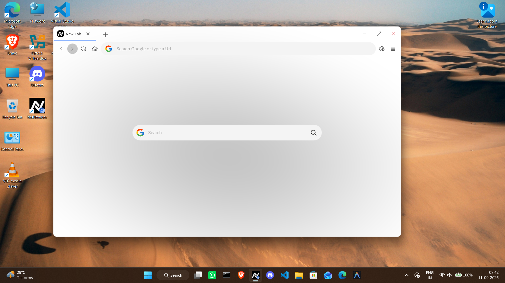
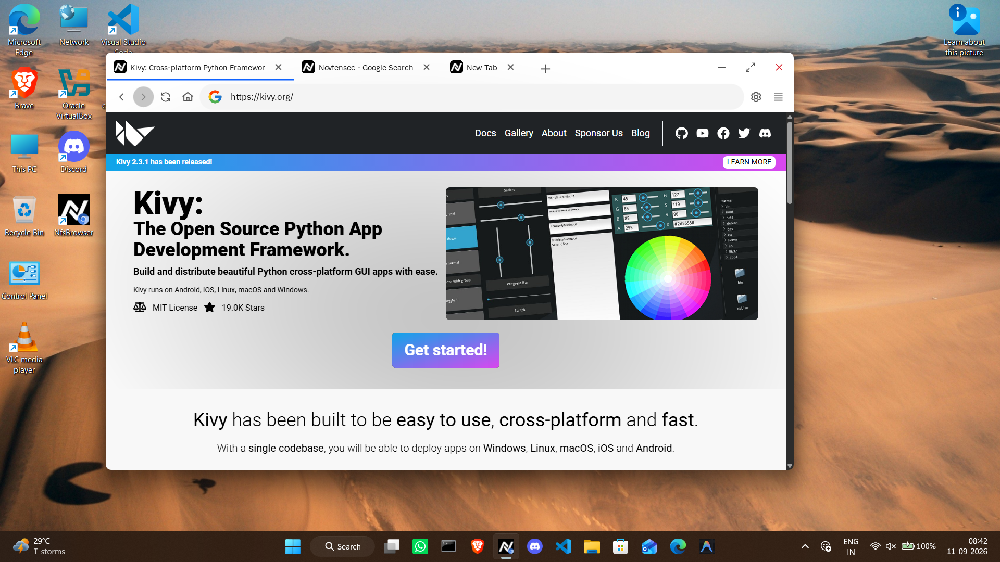
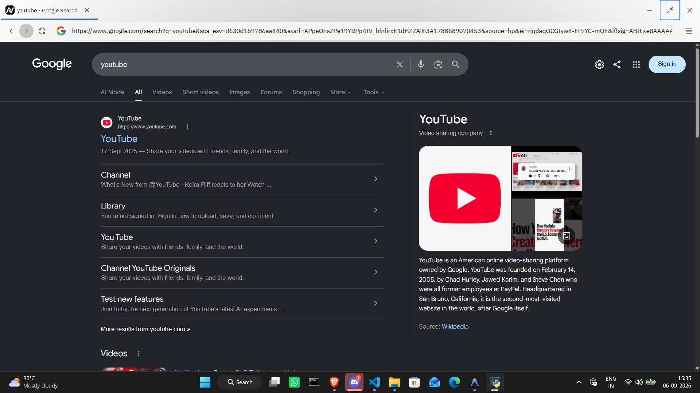

# NfsBrowser

NfsBrowser is a modern web browser built with Python, integrating [Kivy](https://kivy.org), [CarbonKivy](https://carbonkivy.readthedocs.io/en/latest), and the [Chromium Embedded Framework (CEF)](https://github.com/chromiumembedded/cef) via [pybindcef](https://github.com/Novfensec/pybindcef).

<details>
   <summary>Showcase</summary>




</details>

## Financial Support

[](https://github.com/sponsors/Novfensec)
[](https://wise.com/pay/business/kartavyashukla)
[](https://www.paypal.me/KARTAVYASHUKLA)
[](https://opencollective.com/Novfensec)

## Distributions

> Currently for windows only!
>
> Get the latest executable for windows from https://drive.google.com/drive/folders/1d6iknd_MVvbrPHDMBkX-4CwKwTlOinEl?usp=drive_link

## Build Instructions

- You are expected to have a local build of `libcef_dll_wrapper` and precompiled `libcef` from https://cef-builds.spotifycdn.com/index.html.
   > This is required to install pybindcef extension later.

   - Windows (powershell)

      Install the Visual C++ build tools and CMake using Windows Package Manager (`winget`):
      > This has to be done only once.

      ```powershell
      winget install -e --id Microsoft.VisualStudio.BuildTools --override "--passive --wait --add Microsoft.VisualStudio.Workload.VCTools --includeRecommended" --source winget
      winget install -e --id Kitware.CMake --source winget
      ```

      Run the online build script:
      ```powershell
      powershell -ExecutionPolicy ByPass -c "irm https://raw.githubusercontent.com/Novfensec/pybindcef/refs/heads/main/build.ps1 | iex"
      ```

   - Linux:
      ```sh
      curl -LsSf https://raw.githubusercontent.com/Novfensec/pybindcef/refs/heads/main/build.sh | bash
      ```

- Clone the repository:

   ```bash
   git clone https://github.com/Novfensec/NfsBrowser-Desktop
   cd NfsBrowser-Desktop
   ```

- Install dependencies:

   Using `uv` to create a virtual environment and install dependencies from the lockfile:

   ```bash
   pip install uv
   uv sync
   ```

- To start the browser, run the following command from the project root:
   ```bash
   uv run nfsbrowser
   ```

   Or you can manually start the application:

   ```bash
   uv run python src/nfsbrowser/app.py
   ```

- Compile using the ksproject toolchain:
   ```powershell
   # to generate a standalone executable
   uv run ksproject windows build --format standalone

   # to generate an `env` directory with an entrypoint
   uv run ksproject windows build --format directory

   # to generate a `payload.zip` with an entrypoint
   uv run ksproject windows build --format payload
   ```

   Or Debug build so you can see the logs:
   ```powershell
   uv run ksproject windows build debug --format directory
   ```
